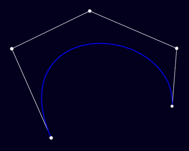

## Lerp Sim

## Instructions
Run the jar with a recent version of java (17 or later) 
https://www.oracle.com/java/technologies/downloads/

## Controls
- Left click to add a dot.
- Right click to remove a dot.
- Use the slider in the bottom right to interpolate between the dots.
- 'r' to delete all dots.
- '1-5' to change theme.
- 'f' to show FPS.

(This program was made using Processing, more info here: https://processing.org/)

https://youtu.be/eStB3qgWo1g?t=41

Please contact for questions or feedback! [maxcontact5@keemail.me](mailto:maxcontact5@keemail.me)

https://github.com/Max-7777
